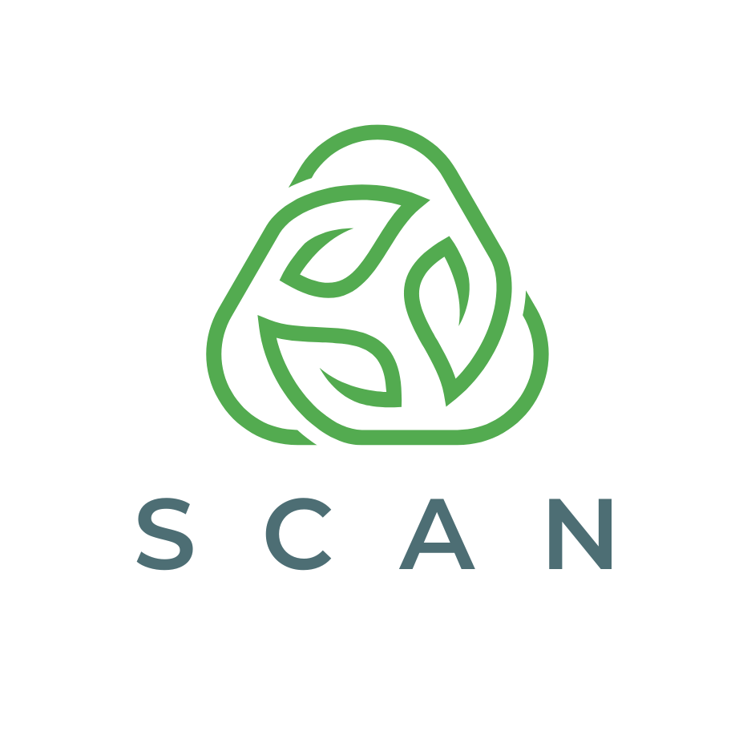

# SCAN (Smart Classification with Automated Neural Network)



Smart Classification with Automated Neural Network

<!-- TABLE OF CONTENTS -->
<details open="open">
  <summary>Table of Contents</summary>
  <ol>
    <li>
      <a href="#about-the-project">About The Project</a>
      <ul>
        <li><a href="#machine-learning-development-documentation">Machine Learning Development Documentation</a></li>
        <li><a href="#mobile-development-documentation">Mobile Development Documentation</a></li>
        <li><a href="#cloud-computing-documentation">Cloud Computing Documentation</a></li>
      </ul>
    </li>
    <li><a href="#usage">Demo Application</a></li>
    <li><a href="#contributing">Contributing</a></li>
    <li><a href="#license">License</a></li>
  </ol>
</details>

## About The Project

SCAN (Smart Classification with Automated Neural Network) Virtual Waste Manager offers a groundbreaking solution by accurately detecting and categorizing recyclable items. This application harnesses advanced technology, particularly artificial intelligence and machine learning, to streamline waste management processes. With its user-centric approach, SCAN (Smart Classification with Automated Neural Network) empowers individuals and organizations to contribute to waste reduction efforts effectively. Through efficient waste sorting, we can collectively work towards a cleaner and more sustainable environment.

## Machine Learning Development Documentation

<!-- Mobile Development Documentation -->
## Mobile Development Documentation


 - ### Feature
      * **Splash screen**, in this application there is a splashscreen before entering the main page

      * **Onboarding Screen**, there is showcase feature for guides when you first use this application

      * **Pick image from gallery**, you can select an image from the gallery in preparation for uploading an image to detect recycle or non-recycle.
 
      * **Take an image from camera**, you can take image from camera in preparation for uploading an image to detect a waste.

      * **scan image to get prediction**, after you prepare the image, you can click the result button to detect the image is recycle or non-recycle.     
      * **Find nearby waste collector**, You can see the nearest waste collector from your location , This is useful for helping you find the nearest waste collector in your location so that it is faster to get the first.
     * **popular waste related article**,  in this application you can read articles about waste management


* #### Dependencies :
  - [Navigation Component] 
  - [Retrofit]  
  - [Glide] 
  - [Material Component]  
  - [CameraX] 
  - [TensorFlow Lite]
  - [Google Play services Maps]
  ### Getting Started Application

  - ### Prerequisites
       - ##### Tools Sofware
        1. Android Studio at least version 4.1. [Android Studio](https://developer.android.com/studio)
        2. JRE (Java Runtime Environment) or JDK (Java Development Kit).
  
  - ### Installation
      1. Get a free API Key at [Google Maps Platform](https://developers.google.com/maps/documentation/android-sdk/get-api-key)
      2. Clone this repository and import into Android Studio    
          ```
             https://github.com/dekwannn/wastemanagement.git
          ``` 
      4. Enter your API in buildConfigField `build.graddle`
         ``` defaultConfig {
            buildConfigField("String", "MAPS_TOKEN", '"Your Api Key"')}
         ```
## Cloud Computing Documentation

## Demo Application


<!-- CONTRIBUTING -->
## Contributing


<!-- LICENSE -->
## License

Distributed under the MIT License. See `LICENSE` for more information.
